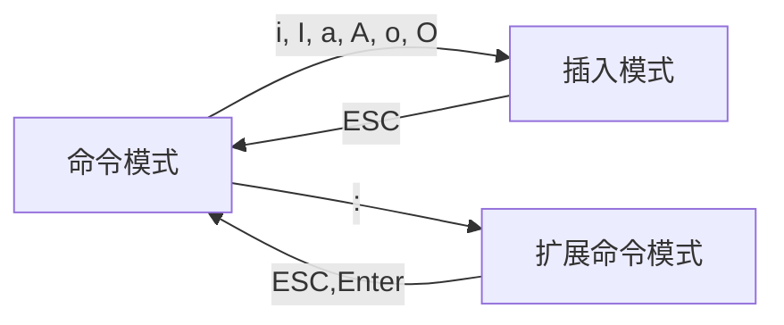

# Linux文本处理&正则表达式&Vim

## 文本处理

**抽取文本的工具**

- 文本内容: `less`和`cat`
- 文件截取: `head`和`tail`
- 按列抽取: `cut`
- 按关键字抽取: `grep`

### 文件查看

#### 文件查看命令

`cat`, `tac,`, `rev`

- `cat [OPTION]... [FILE]...`
    - `-E`: 显示行结束符$
    - `-n`: 对显示出的每一行进行编号
    - `-A`: 显示所有控制符
    - `-b`: 非空行编号
    - `-s`: 压缩连续空行成一行
- `tac`: 从最后一行显示到第一行
- `rev`: 行的顺序不变, 每行中的字符反向输出

#### 分页查看文件内容

`more`, `less`

- `more`: 分页查看文件
    - 语法: `more [OPTIONS...] FILE...`
    - OPTIONS :
        - `-d`: 显示翻页(space)及退出(q)帮助而不是响铃
        - `-f`: 计算行数时, 以实际上的行数而非自动换行过后的行数(有些单行字数太长的会被自动换行)
        - `-l`: 取消遇见特殊字元`^L`(送纸字元)时会暂停的功能
        - `-p`: 取消滚动, 清理屏幕并显示文字
        - `-c`: 取消滚动, 显示文本并清理行尾
        - `-u`: 不显示下引号(根据环境变量TERM指定的terminal而有所不同)
        - `-s`: 将多个空白行压缩为一行
        - `-NUM`: 一次显示NUM行
        - `+NUM`: 从第NUM行开始显示
        - `+/STRING`: 从搜索字符串匹配开始显示文件
        - `-V`: 输出版本信息并退出
    - 查看时常用的命令
        - <kbd>Enter</kbd>: 向下n行, 需要定义. 默认为1
        - <kbd>Ctrl</kbd>+<kbd>f</kbd>, <kbd>空格</kbd>: 向下滚动一屏
        - <kbd>Ctrl</kbd>+<kbd>b</kbd>: 返回上一屏
        - <kbd>=</kbd>: 输出当前行的行号
        - `:f`: 输出当前文件名和当前行号
        - <kbd>v</kbd>: 调用vi编辑器
        - `!命令`: 调用shell脚本并执行命令
        - <kbd>q</kbd>: 退出
- `less`: 一页一页地查看文件或STDIN输出
    - 语法`less [OPTIONS] file`
    - OPTIONS
        - `-b [N]`: 设置缓冲区大小
        - `-e`: 当文件显示结束后自动退出
        - `-f`: 强迫打开特殊文件, 例如外围设备代号, 目录和二进制文件
        - `-g`: 直标志最后搜索的关键词
        - `-i`: 忽略搜索时的大小写
        - `-m`: 显示类似more的百分比
        - `-N`: 显示行号
        - `-o 文件名`: 将less输出的内容在指定文件中保存起来
        - `-Q`: 不使用警告音
        - `-s`: 显示连续空行为一行
        - `-S`: 行过长时将超出部分舍弃
        - `-x 数字`: 将"tab"键显示为规定的数字空格
    - 查看时有用的命令包括
        - <kbd>e</kbd>, <kbd>Ctrl</kbd>+<kbd>e</kbd>, <kbd>j</kbd>, <kbd>Ctrl</kbd>+<kbd>N</kbd>, <kbd>Enter</kbd>: 下一行
        - <kbd>y</kbd>, <kbd>Ctrl</kbd>+<kbd>y</kbd>, <kbd>k</kbd>, <kbd>Ctrl</kbd>+<kbd>k</kbd>, <kbd>Ctrl</kbd>+<kbd>p</kbd>: 上一行
        - <kbd>f</kbd>, <kbd>Ctrl</kbd>+<kbd>f</kbd>, <kbd>Ctrl</kbd>+<kbd>v</kbd>, <kbd>Space</kbd>: 下一屏
        - <kbd>b</kbd>, <kbd>Ctrl</kbd>+<kbd>b</kbd>, <kbd>ESC</kbd><kbd>v</kbd>: 上一屏
        - <kbd>z</kbd>: 下一屏, 并设置缓冲区为当前窗口高度
        - <kbd>w</kbd>: 上一屏, 并设置缓冲区为当前窗口高度
        - <kbd>ESC</kbd><kbd>Space</kbd>: 下一屏, 但是在文件结尾不停止
        - <kbd>d</kbd>, <kbd>Ctrl</kbd>+<kbd>d</kbd>: 下半屏, 并设置缓冲区为窗口一半的高度
        - <kbd>u</kbd>, <kbd>Ctrl</kbd>+<kbd>u</kbd>: 上半屏, 并设置缓冲区为窗口一半的高度
        - <kbd>ESC</kbd><kbd>)</kbd>, `右方向键`: 
        - <kbd>ESC</kbd><kbd>(</kbd>, `左方向键`: 
        - <kbd>F</kbd>: 跟随, 类似于`tail -f`
        
        - <kbd>r</kbd>, <kbd>Ctrl</kbd>+<kbd>r</kbd>, <kbd>Ctrl</kbd>+<kbd>l</kbd>: 重新绘制屏幕
        
        - <kbd>R</kbd>: 重新绘制屏幕, 丢弃缓存输入
        - `/文本`: 向下搜索文本
        - `?文本`: 向上搜索文本
        - `n`/`N`: 跳到下一个/上一个匹配
        - <kbd>ESC</kbd><kbd>n</kbd>/<kbd>N</kbd>: 跳到下一个/上一个匹配, 跨越文件
        - `&文本`: 只显示匹配的行
        - <kbd>g</kbd>, <kbd>\<</kbd>, <kbd>ESC</kbd><kbd>\<</kbd>: 跳到第一行
        - <kbd>G</kbd>, <kbd>\></kbd> <kbd>ESC</kbd><kbd>\></kbd>: 跳到最后一行
        - <kbd>p</kbd>, `%`: 跳到文件的开始
        - <kbd>t</kbd>: 跳到下一个标签
        - <kbd>T</kbd>: 跳到上一个标签
        - <kbd>{</kbd>, <kbd>(</kbd>, <kbd>[</kbd>: 查找对应的} ) ]
        - <kbd>}</kbd>, <kbd>)</kbd>, <kbd>]</kbd>: 查找对应的{ ( [
        - <kbd>ESC</kbd><kbd>Ctrl</kbd>+<kbd>f</kbd> `<c1> <c2>`: 查找右括号\<c2\>
        - <kbd>ESC</kbd><kbd>Ctrl</kbd>+<kbd>f</kbd> `<c1> <c2>`: 查找左括号\<c1\>
        - <kbd>h</kbd>: 显示帮助
        - <kbd>q</kbd>:　退出
    - `less`命令是man命令使用的分页器

可以结合管道, 将一些命令的执行结果做分页处理. 

例如: `ll /etc | less`或`ll /etc | more`


#### 显示文本前或后行内容

`head`, `tail`, `tailf`

- `head [OPTION]... [FILE]...`
    - `-c #`: 指定获取前#字节
    - `-n #`: 指定获取前n行
    - `-#`: 指定行数
- `tail [OPTION]... [FILE]...`
    - `-c #`: 指定获取后#字节
    - `-n #`: 指定获取后#行
    - `-#`: 指定行数
    - `-f`, `--follow=descriptor`: 跟踪显示文件fd新追加的内容, 常用日志监控
    - `-F`, `--follow=name --retry`: 跟踪文件名. 
- `tailf`: 类似于`tail -f`, 当文件不增长时并不访问文件, 比较省资源

可以结合管道, 将一些命令的执行结果做处理. 

例如: `ifconfig | head -10`, `ifconfig | tail -10`, `ifconfig | head -2 | tail -1`

口令生成器: `cat /dev/urandom | tr -dc 'a-zA-Z0-9_' | head -c32`

### 文本处理

#### 按列抽取文本cut

`cut [OPTION]... [FILE]...`
- `-d DELEMITER`: 指明分隔符, 默认tab
- `-f FILEDS`: 
    - `#`: 第#个字段
    - `#,#[,#]`: 离散的多个字段, 例如1,3,6
    - `#-#`: 连续的多个字段, 例如1-6
    - `混合使用`: 例如1-3,7
- `-c`: 按字符切割
- `--output-delimiter=STRING`: 指定输出分隔符
- 示例
    - 取出用户名和uid
    
      ```bash
      cut -d : -f 1,3 /etc/passwd
      或指定输出分隔符
      cut -d : -f 1,3 --output-delimiter=* /etc/passwd
      ```
    
    - 取出分区利用率
    
      ```bash
      df | tr -s ' ' % | cut -d% -f5
      ```
    
    - 取出网卡的ip地址
    
      ```bash
      ifconfig eth0| head -n2 | tail -n1 | tr -s ' ' '/' | cut -d/ -f3
      或
      ifconfig eth0| head -n2 | tail -n1 | tr -s ' ' | cut -d' ' -f3
      或
      ifconfig eth0 | head -2 | tail -1 | tr -dc '[0-9]. '| tr -s ' ' | cut -d' ' -f2
      ```


#### 横向合并paste

`paste [OPTION]... [FILE]...`: 合并两个文件同行号的列到一行
- `-d 分隔符`: 指定分隔符, 默认用TAB
- `-s`: 将列变成行来显示
- 示例
    - `paste f1 f2`
    - `paste -s f1 f2`


### 分析文本

#### 文本数据统计: wc(word count)

- 计数行总数, 单词总数, 字节总数和字符总数
- 可以对文件或STDIN中的数据运行
    ```bash
    $ wc story.txt
    39      237     1901    story.txt
    行数    单词数  字节数  文件名
    ```
- 常用选项
    - `-l`: 只计数行数
    - `-w`: 只计数单词总数
    - `-c`: 只计数字节总数
    - `-m`: 只计数字符总数
    - `-L`: 显示文件中最长行的长度

- 示例
    - 查看文档中的所有单词个数
        ```bash
        cat /etc/profile | tr -cs 'a-zA-Z' '\n' | wc -l
        ```

#### 文本排序sort

- 把整理过的文本显示在STDOUT, 不改变原始文件
    ```bash
    sort [OPTION]... [FILE]...
    ```
- 常用选项:
    - `-r`: 倒序
    - `-R`: 随机排序
    - `-n`: 按数字大小排序
    - `-f`: 忽略字符串中的字符大小写
    - `-u`: 删除输出中的重复行
    - `-t c`: 使用c作为字段界定符
    - `-k X`: 按照使用c字符分割的X列来整理能够使用多次

- 示例
    - 按照uid排序
    
      ```bash
      sort -t: -k3 /etc/passwd
      ```
    
    - 抽奖
    
      ```bash
      seq 63 | sort -R | head -n1
      ```
    
    - 查找分区利用率最大的值
    
      ```bash
      df | tr -s ' ' '%' | cut -d% -f5 | sort -nr | head -n1
      ```

#### uniq

- 从输入中删除前后相接的重复的行
- `uniq [OPTION]... [FILE]...`
    - `-c`: 显示每行重复出现的次数
    - `-d`: 仅显示重复过的行
    - `-u`: 仅显示不曾重复的行
    注: 连续且完全相同方为重复
- 常和`sort`命令一起配合使用
    ```bash
    sort userlist.txt | uniq -c
    ```

#### 比较文件: diff

- 比较两个文件之间的区别
- `diff [OPTION]... FILES`
- OPTION
    - `-u`: 

**示例**

- 不加参数的`diff f1 f2`

    1. 使用`paste`查看f1和f2

       ```bash
       $ paste f1 f2
       aaa	aaa
       bbb	bbb
       ccc	cc
       ddd	eee
       eee	fff
       fff	ggg
       ggg	hhh
       hhh	jjj
       iii	kkk
       jjj	lll
       kkk	mmm
       lll	nnn
       	ooo
       ```

    2. 使用`diff f1 f2`查看区别

       ```bash
       $ diff f1 f2
       3,4c3
       < ccc
       < ddd
       ---
       > cc
       9d7
       < iii
       12a11,13
       > mmm
       > nnn
       > ooo
       ```

    3. 说明

       - `3,4c3`表示f1文件的3-4行被修改(c(change))为f2文件的第3行, 其中`< ccc`, `< ddd`表示删除(<)了f1的第3行的`ccc`和第4行的`ddd`, `---`表示上方为f1, 下方为f2, `> cc`表示f2中第3行增加(>)了`cc`

       - `9d7`表示f1文件的第9行被删除(d(delete))了, f1中被删除(<)的行内容是`iii`

       - `12a11,13`表示在f1的第12行添加(a)了内容, 对应f2文件的11-13行, f2中增加(>)的内容是`mmm`, `nnn`, `ooo`

- 使用`-u`选项  
    ```bash
    $ diff -u f1 f2
    --- f1	2020-04-14 13:52:17.972393288 +0800
    +++ f2	2020-04-14 14:22:36.610610276 +0800
    @@ -1,12 +1,13 @@
     aaa
     bbb
    -ccc
    -ddd
    +cc
     eee
     fff
     ggg
     hhh
    -iii
     jjj
     kkk
     lll
    +mmm
    +nnn
    +ooo
    ```
    说明: 
    
    -  `---`表示变动前的文件, `+++`表示变动后的文件
    
    -  `-1,12`, `-`表示f1, `1`表示从第1行开始, `12`表示连续12行
    
    - `+1,13`, `+`表示f2, `1`表示从第一行开始, `13`表示连续13行
    
    - `-1,12 +1,13`即表示下面显示的是f1的从第1行开始连续12行以及f2从第1行开始连续13行的内容
    
    - 下方具体变动部分, 带`-`的表示从f1中删除的, 带`+`表示f2中新增的, 不带任何标识的表示没有发生变化

#### 修补文件patch

- `patch`: 复制在其他文件中进行的改变
- 语法: `patch [OPTION]... [ORIGFILE [PATCHFILE]]`
- OPTION
    - `-b`: 备份每一个原始文件
- 示例
    ```bash
    # 将`diff -u f1 f2`输出的结果保存在一种叫"补丁"的文件中
    $ diff -u f1 f2 > f1.patch
    # 使用"补丁"文件对f1进行升级操作
    $ patch -b f1 f1.patch
    ```

#### 练习

1. 查出/tmp的权限, 以数字方式显示

   ```bash
   stat /tmp |head -n4|tail -n1|cut -d/ -f1|cut -d'1' -f2
   ```


### Linux文本处理三剑客

- `grep`: 文本过滤工具
`grep`, `egrep`, `fgrep`(不支持正则表达式搜索)
- `sed`: stream editor, 文本编辑工具
- `awk`: Linux上的实现gawk, 文本报告生成器

#### grep

- `grep`: Global search REgular expression and Print out the line
- 作用: 文本搜索工具, 根据用户指定的"模式"对目标文本逐行进行匹配检查; 打印匹配到的行
    - 模式: pattern, 由正则表示式字符及文本字符所编写的过滤条件
- 语法: `grep [OPTION]... PATTERN [FILE]...`
- 选项:
    - `--color=auto`: 对匹配到的文本着色显示
    - `-v`: 显示不被pattern匹配到的行
    - `-i`: 忽略字符大小写
    - `-n`: 显示匹配的行号
    - `-c`: 统计匹配的行数
    - `-o`: 仅显示匹配到的字符串
    - `-q`: 静默模式, 不输出任何信息
    - `-A #`: after, 后#行
    - `-B #`: before, 前#行
    - `-C #`: context, 前后各#行
    - `-e`: 实现多个选项间的逻辑or关系
        - `grep -e 'cat' -e 'dog' file`
    - `-w`: 匹配整个单词
    - `-E`: 使用ERE
    - `-F`: 相当于fgrep, 不支持正则表达式
    - `-f file`: 根据模式文件处理

#### sed

#### awk

## 正则表达式

文件通配符参考[4.1.9文件通配符]()

**REGEXP :** Regular Expressions, 由一类特殊字符及文本字符所编写的模式, 其中有些字符(元字符)不代表字符字面意义, 而表示控制或通配的功能.

**程序支持 :** `grep`, `sed`, `awk`, `vim`, `less`, `nginx`, `varnish`等

**分两类 :**
- 基本正则表达式: BRE
- 扩展正则表达式: ERE

**正则表达式引擎 :** 采用不同算法, 检查处理正则表达式的软件模块, 例如: PCRE(Perl Compatible Regular Expressions)

**元字符分类 :** 字符匹配, 匹配次数, 位置锚定, 分组

**帮助文档 :**`man 7 regex`

### 基本正则表达式

#### 基本正则表达式元字符

**字符匹配 :**

- `.`: 匹配任意单个字符
- `[]`: 匹配指定范围内的任意单个字符, 示例: `[wang]`, `[0-9]`, `[a-z]`, `[a-zA-Z]`
- `[^]`: 匹配指定范围外的任意单个字符
- `[:alnum]`: 字母和数字
- `[:alpha:]`: 任何大小写字母, 等同于`[a-zA-Z]`
- `[:lower:]`: 小写字母, 等同于`[a-z]`
- `[:upper:]`: 大写字母, 等同于`[A-Z]`
- `[:blank:]`: 空白字符(空格和制表符)
- `[:space:]`: 水平和垂直的空白字符(比`[:blank:]`包含范围更广)
- `[:cntrl:]`: 不可打印的控制字符(退格, 删除, 警铃等)
- `[:digit:]`: 十进制数字, 等同于`[0-9]`
- `[:xdigit:]`: 十六进制数字
- `[:graph:]`: 可打印的非空白字符
- `[:print:]`: 可打印字符
- `[:punct:]`: 标点符号

**匹配次数**

用在要指定次数的字符后面, 用于指定前面的字符要出现的次数

- `*`: 匹配前面的字符任意次, 包括0次. 贪婪模式: 尽可能长的匹配
- `.*`: 任意长度的任意字符
- `\?`: 匹配其前面的字符0或1次
- `\+`: 匹配其前面的字符至少1次
- `\{n\}`: 匹配前面的字符n次
- `\{m,n\}`: 匹配前面的字符至少m次, 至多n次
- `\{,n\}`: 匹配前面的字符至多n次
- `\{n,\}`: 匹配前面的字符至少n次

**位置锚定**

定位出现的位置

- `^`: 行首锚定, 用于模式的最左侧
- `$`: 行尾锚定, 用于模式的最右侧
- `^PATTERN$`: 用于模式匹配整行
    - `^$`: 空行
    - `^[[:space:]]$`: 空白行
- `\<`或`\b`: 词首锚定, 用于单词模式的左侧
- `\>`或`\b`: 词尾锚定, 用于单词模式的右侧
- `\<PATTERN\>`: 匹配整个单词

**分组**

- `\(\)`: 将一个或多个字符捆绑在一起, 当作一个整体处理, 如: `\(root\)+`
- `\|`: 或, 示例: `a\|b`: a或b, `C\|cat`: c或cat, `\(C\|c\)at`: Cat或cat
    - 例如`grep "^\(a\|b\)" /etc/passwd`, 
    **后向引用 :**

分组括号中的模式匹配到的内容会被正则表达式引擎记录于内部的变量中, 这些变量的命名方式为: `\1`, `\2`, `\3`, `...`

`\1`表示从左侧起第一个左括号以及与之匹配有括号之间的模式所匹配到的字符串

示例: `\(string1\+\(string2\)*\)`
    - `\1`: `string1\+\(string2\)*`
    - `\2`: `string2`
    
**后向引用引用的是前面的分组括号中的模式所匹配字符, 而非模式本身**
示例: `grep "\(root\).*\1" /etc/passwd`

#### 练习

1. 显示/proc/meminfo文件中以大小s开头的行(要求: 使用两种方法)

   ```bash
   grep "^[Ss]" /proc/meminfo
   grep "^\(s\|S\)" /proc/meminfo
   ```

2. 显示/etc/passwd文件中不以/bin/bash结尾的行

   ```bash
   grep "/bin/bash$" /etc/passwd
   ```

3. 显示用户rpc默认的shell程序

   ```bash
   
   ```

4. 找到/etc/passwd中的两位或三位数

   ```bash
   grep "[0-9]\{2,3\}" /etc/passwd
   ```

5. 显示CentOS7的/etc/grub2.cfg文件中, 至少以一个空白字符开头的且后面有非空白字符的行

   ```bash
   grep "^[[:space:]]\{1,\}[^[:space:]]" /etc/grub2.cfg
   ```

6. 找出`netstat -tan`命令结果中以LISTEN后跟任意多个空白字符结尾的行

   ```bash
   netstat -tan | grep "LISTEN[[:space:]]*$"
   ```

7. 显示CentOS7上所有系统用户的用户名和UID

   ```bash
   cut -d: -f1,3 /etc/passwd
   ```

8. 添加用户bash, testbash, basher, sh, nologin(其shell为/sbin/nologin), 找出/etc/passwd用户名和shell同名的行

9. 利用`df`和`grep`, 取出磁盘各分区利用率, 并从大到小排序

   ```bash
   
   ```

### 扩展正则表达式

#### egrep及扩展正则表达式

- `egrep` = `grep -E`

- `egrep [OPTIONS] PATTERN [FILE]...`

#### 扩展正则表达式元字符

**字符匹配**

- `.`: 任意字符
- `[]`: 指定范围的字符
- `[^]`: 不在指定范围的字符

**次数匹配**

- `*`: 匹配前面字符任意次数, 包括0次
- `?`: 0或1次
- `+`: 1次或多次
- `{m}`: m次
- `{m,n}`: 至少m, 至多n次
- `{m,}`: 至少m次
- `{,n}`: 至多n次

**位置锚定**

- `^`: 行首
- `$`: 行尾
- `\<`, `\b`: 词首
- `\>`, `\B`: 词尾

**分组**

- `()`: 分组
- `\1`, `\2`, `...`: 后向引用
- `|`: 或者


#### 练习

1. 显示三个用户root, linux, wang的UID和默认shell

   ```bash
   cut -d: -f1,7 /etc/passwd | grep -E  "^((root)|(linux)|(wang))"
   ```

2. 找出/etc/rc.d/init.d/functions文件中行首为某单词(包括下划线)后面跟一个小括号的行

   ```bash
   egrep "^\b()" /etc/rc.d/init.d/functions
   ```


3. 使用`egrep`取出/etc/rc.d/init.d/functions中其基名

   ```bash
   echo "/etc/rc.d/init.d/functions" | egrep -o "[^/]+$"
   ```

4. 使用`egrep`取出上面路径的目录名

   ```bash
   echo "/etc/rc.d/init.d" | egrep -o ".*[^/]" | egrep -o ".*/"
   ```

5. 统计`last`命令中以root登录的每个主机IP地址登录次数

   ```bash
   echo "/etc/rc.d/init.d" | egrep -o ".*[^/]" | egrep -o ".*/"
   ```

6. 利用扩展正则表达式分别表示0-9, 10-99, 100-199, 200-249, 250-255

    - 0-9: `[0-9]`
    - 10-99: `[1-9][0-9]`
    - 100-199: `1[0-9]{2}`
    - 200-249: `2[0-4][0-9]`
    - 250-255: `25[0-5]`

7. 显示`ifconfig`命令结果中所有IPv4地址

    ```bash
    ifconfig | grep -Eo "(([1-9]?[0-9]|1[0-9]{2}|2[0-4][0-9]|25[0-5])\.){3}([1-9]?[0-9]|1[0-9]{2}|2[0-4][0-9]|25[0-5])"
    ```

8. 将此字符串: welcome to linux中的每个字符去重并排序, 重复次数多的排在前面

    ```bash
    
    ```

## vim


- `vi`: Visual Interface, 文本编辑器
- 文本: ASCII, Unicode
- 文本编辑器种类
    - 行编辑器: `sed`
    - 全屏编辑器: `nano`, `vi`
    - `vim`: Vi Improved
- 其他编辑器
    - `gedit`: 一个简单的图形编辑器
    - `gvim`:  一个Vim编辑器的图形版本

### Vim命令小抄


### 打开文件

- 语法: `vim [OPTION]... FILE...`
- OPTION
    - `+#`: 打开文件后, 让光标处于第#行行首, `+`默认最后一行行首
    - `+/PATTERN`: 打开文件后, 直接让光标处于第一个被PATTERN匹配到的行的行首
    - `-b`: 二进制方式打开文件
    - `-d file1 file2 ...`: 比较多个文件
    - `-m`: 制度打开文件
    - `-e`: ex模式, 也可以直接使用`ex file`
- 如果该文件存在, 文件被打开并显示内容; 如果文件不存在, 当编辑后第一次存盘时会创建它

### vim: 一个模式编辑器

击键行为依赖与vim的"模式"

3种主要模式:
- 命令(Normal)模式: 默认模式, 可用来移动光标, 剪切/粘贴文本等
- 插入(Insert)或编辑模式: 修改文本内容
- 扩展命令(EXtended command)模式: 保存, 退出等

### 模式转换


**命令模式 --> 插入模式**

- <kbd>i</kbd>: insert, 在光标所在处输入
- <kbd>I</kbd>: 在光标所在行的行首输入
- <kbd>a</kbd>: append, 在光标所在处后面输入
- <kbd>A</kbd>: 在光标所在行的行尾输入
- <kbd>o</kbd>: 在光标所在行的下方打开一个新行
- <kbd>O</kbd>: 在光标所在行的上方打开一个新行



### 关闭文件

**扩展命令模式**

- `:q`: 退出
- `:q!`: 强制退出, 丢弃所做的修改
- `wq`: 保存退出
- `x`: 保存退出
- `wq!`: 强制保存并退出

**命令模式**

- <kbd>Z</kbd><kbd>Z</kbd>: 保存退出
- <kbd>Z</kbd><kbd>Q</kbd>: 不保存退出


### 扩展命令模式

插入模式使用`:`进入扩展命令模式, 创建一个命令提示符`:`, 处于屏幕的左下角

**命令 :**

- `w`: 写(存)磁盘文件
- `wq`: 写入并退出
- `x`: 写入并退出
- `q`: 退出
- `q!`: 不存盘退出, 将丢失所有更改
- `r filename`: 读指定文件内容到当前文件中
- `w filename`: 将当前文件内容写入另一个文件
- `!command`: 执行命令
- `r!command`: 读入命令的输出

### 命令模式

#### 光标跳转

**字符间跳转**

- <kbd>h</kbd>: 左
- <kbd>l</kbd>: 右
- <kbd>j</kbd>: 下
- <kbd>k</kbd>: 上
- `#COMMAND`: 跳转由#指定的个数的字符

**单词间跳转**
- <kbd>w</kbd>: 下一个单词的词首
- <kbd>e</kbd>: 当前或下一个单词的词尾
- <kbd>b</kbd>: 当前或前一个单词的词首
- `#COMMAND`: 由#指定一次跳转的单词数

**当前页跳转**
- <kbd>H</kbd>: 页首
- <kbd>M</kbd>: 页中间行
- <kbd>L</kbd>: 页底
- <kbd>z</kbd><kbd>t</kbd>: 将光标所在行移动到屏幕顶端
- <kbd>z</kbd><kbd>z</kbd>: 将光标所在行移动到屏幕中间
- <kbd>z</kbd><kbd>b</kbd>: 将光标所在行移动到屏幕底端

**行首行尾跳转**

- `^`: 跳转至行首第一个非空白字符
- `0`: 跳转至行首
- `$`: 跳转至行尾

**行间移动**
- `#`<kbd>G</kbd>: 扩展命令模式下, 跳转到第#行
- <kbd>G</kbd>: 跳到最后一行
- <kbd>1</kbd><kbd>G</kbd>, <kbd>g</kbd><kbd>g</kbd>: 跳转到第一行

**句间移动**
- <kbd>)</kbd>: 下一句
- <kbd>(</kbd>: 上一句

**段落间移动**
- <kbd>}</kbd>: 下一段
- <kbd>{</kbd>: 上一段


#### 翻屏操作

- <kbd>Ctrl</kbd>+<kbd>f</kbd>: 向文件尾部翻一屏
- <kbd>Ctrl</kbd>+<kbd>b</kbd>: 向文件首部翻一屏
- <kbd>Ctrl</kbd>+<kbd>d</kbd>: 向文件尾部翻半屏
- <kbd>Ctrl</kbd>+<kbd>u</kbd>: 向文件首部翻半屏

#### 修改操作

**字符编辑**
- <kbd>x</kbd>: 剪切光标处的字符
- `#`<kbd>x</kbd>: 剪切光标处起始的#个字符
- <kbd>x</kbd><kbd>p</kbd>: 交换光标所在处的字符及其后面字符的位置(剪切后粘贴)
- `~`: 转换大小写
- <kbd>J</kbd>: 删除当前行后的换行符

**替换命令(r, replace)**

- `r`: 替换光标所在处的字符
- `R`: 切换成REPLACE模式

**删除(剪切)指令(d, delete)**

- <kbd>d</kbd>: 删除命令, 可结合光标跳转字符, 实现范围删除
- `#`<kbd>d</kbd><kbd>h</kbd>/`#`<kbd>d</kbd><kbd>l</kbd>: 向左/右删除#个字符
- `#`<kbd>d</kbd><kbd>j</kbd>/`#`<kbd>d</kbd><kbd>k</kbd>: 删除当前行并向下/上删除#行
- <kbd>d</kbd>`$`: 删除至行尾
- <kbd>d</kbd>`^`: 删除到非空行首
- <kbd>d</kbd>`0`: 删除到行首
- <kbd>d</kbd><kbd>w</kbd>: 从光标处删除到下一个单词的词首
- <kbd>d</kbd><kbd>e</kbd>: 从光标处删除到下一个单词的词尾
- <kbd>d</kbd><kbd>b</kbd>: 从光标处删除到上一个单词的词首
- <kbd>d</kbd>`G`: 从光标所在行删除到文件末尾
- <kbd>d</kbd><kbd>g</kbd><kbd>g</kbd>: 从光标所在行删除到文件顶端
- `#`<kbd>d</kbd>`*`: *代表任意可以移动光标的操作
- <kbd>d</kbd><kbd>d</kbd>: 删除光标所在行, 剪切
- `#`<kbd>d</kbd><kbd>d</kbd>: 删除下#行
- `D`: 从当前光标位置删除至行尾, 等同于`d$`

**复制指令(y, yank)**

- <kbd>y</kbd>: 复制, 行为类似于d命令
- <kbd>y</kbd>`$`: 
- <kbd>y</kbd>`0`:
- <kbd>y</kbd>`^`:
- <kbd>y</kbd><kbd>e</kbd>:
- <kbd>y</kbd><kbd>w</kbd>:
- <kbd>y</kbd><kbd>b</kbd>:
- `#`<kbd>y</kbd>`*`: *代表任意可以移动光标的操作
- `#`<kbd>y</kbd><kbd>y</kbd>: 复制多行
- `Y`: 复制整行

**粘贴指令(p, paste)**

- <kbd>p</kbd>: 缓存区存的如果为整行, 则粘贴当前光标所在行的下方; 否则, 粘贴至当前光标所在处的后面
- <kbd>p</kbd>: 缓存区存的如果为整行, 则粘贴当前光标所在行的上方; 否则, 粘贴至当前光标所在处的前面

**改变命令(c, change)**

`c`相当于`d`剪切后使用`i`进入插入模式

- <kbd>c</kbd>: 修改后切换成插入模式
- <kbd>c</kbd>`$`:
- <kbd>c</kbd>`^`:
- <kbd>c</kbd>`0`:
- <kbd>c</kbd><kbd>b</kbd>:
- <kbd>c</kbd><kbd>e</kbd>:
- <kbd>c</kbd><kbd>w</kbd>:
- `#COMMAND`:
- <kbd>c</kbd><kbd>c</kbd>: 删除当前行并输入新内容, 相当于`S`
- `#`<kbd>c</kbd><kbd>c</kbd>: 删除多行并进入插入模式
- `C`: 删除当前光标到行尾, 并切换成插入模式, 相对于`c$`


**撤销更改(u)**

- <kbd>u</kbd>: 撤销最近的更改
- `#`<kbd>u</kbd>: 撤销之前#次更改
- `U`: 撤销光标落在这行后所有此行的更改
- <kbd>Ctrl</kbd>+<kbd>r</kbd>: 重做最后的"撤销"更改
- <kbd>.</kbd>: 重复前一个操作
- `n`<kbd>.</kbd>: 重复前一个操作n次

**缩进命令**

- <kbd>\></kbd><kbd>\></kbd>: 向右缩进一个Tab
- <kbd>\<</kbd><kbd>\<</kbd>: 向左缩进一个Tab
- `#`<kbd>\></kbd><kbd>\></kbd>/`#`<kbd>\<</kbd><kbd>\<</kbd>: 向右/左缩进#个Tab

**其他命令**

- `#`<kbd>i</kbd>`str`<kbd>ESC</kbd>: 粘贴"str"#次
- `<start position><command><end position>`
    - COMMAND:
        - <kbd>y</kbd>: 复制
        - <kbd>d</kbd>: 删除
        - <kbd>g</kbd>`U`: 变大写
        - <kbd>g</kbd><kbd>u</kbd>: 变小写
    - 示例:
    - `0`<kbd>y</kbd>`$`: 从行首拷贝到行尾
    - <kbd>y</kbd><kbd>e</kbd>: 从当前位置拷贝到本单词的最后一个字符
- <kbd>d</kbd><kbd>i</kbd>`"`: 光标在`""`之间, 则删除`""`之间的内容
- <kbd>y</kbd><kbd>i</kbd><kbd>(</kbd>: 光标在()之间, 则复制()之间的内容
- <kbd>v</kbd><kbd>i</kbd><kbd>[</kbd>: 光标在[]之间, 则选中[]之间的内容
- <kbd>d</kbd><kbd>t</kbd><kbd>x</kbd>: 删除字符直到遇见光标后的第一个x字符
- <kbd>y</kbd><kbd>t</kbd><kbd>x</kbd>: 复制字符直到遇见光标后的第一个x字符

可将上方的<kbd>d</kbd>, <kbd>y</kbd>互换, 达到相应效果

### 扩展命令模式

#### 地址定界

- 格式: `:#COMMAND`或`:#,@COMMAND`

- `#`: 具体第#行
- `#,@`: 从#行开始到@行结束
- `#,+@`: 从#行开始到#+@行结束
    - `:2,+3`: 表示从2到5行
- `.`: 当前行
- `$`: 最后一行
    - `:.,$-1`: 从当前行到倒数第二行
- `%`: 全文, 相当于`1,$`

- `/pattern1/,/pattern2/`: 从第一次被pattern1匹配到的行开始, 一直到被pattern2匹配到的行结束
- `#,/pattern/`: 从第#行开始到第一次被pattern匹配到的行结束
- `/pattern/,$`: 从第一次配pattern匹配到的行开始到文件结束

- 使用方式:后跟一个编辑命令
    - `d`:
    - `y`:
    - `w file`: 将范围内的行另存至指定文件中
    - `r file`: 在指定位置插入指定文件中的所有内容

#### 查找

- `/PATTERN`: 从当前光标所在处向文件尾部查找
- `?PATTERN`: 从当前光标所在处向文件顶部查找
- `n`: 与命令同方向
- `N`: 与命令反方向

#### 查找并替换

`s`: 在扩展模式下完成查找替换操作

- 格式: `:范围s/要查找的内容/替换为的内容/修饰符`
    - 范围: 可使用上方的地址界定格式
    - 要查找的内容: 可使用模式
    - 替换为的内容: 不能使用模式, 但可以使用`\1`, `\2`,...等后向引用; 还可以使用`&`引用前面查找时查找到的整个内容
    - 修饰符: 
        - `i`: 忽略大小写
        - `g`: 全局替换, 如果不指定, 默认替换的只有每一行中的第一个
        - `gc`: 全局替换, 每次替换前询问
- 查找替换中的分隔符`/`可替换为其他字符, 例如
    - `s@/etc@/var@g`
    - `s#/bin/nologin#/bin/nologin`

练习:

1. 将/etc/default/grub文件中的GRUB_CMDLINE_LINUX行的引号内追加xyz

   ```bash
   :%s/\(.*CMD.*\)"/\1 xyz"
   ```

2. 复制/etc/profile至/tmp目录, 用查找替换命令删除/tmp/profile文件中的行首的空白字符

   ```bash
   
   ```

3. 复制/etc/rc.d/init.d/functions文件到/tmp目录, 用查找替换命令为/tmp/functions的每行开头为空白字符的行的行首添加一个#号

   ```bash
   
   ```

4. 复制/etc/fstab到/tmp目录, 用查找替换命令为/tmp/fstab的每行不以#开头的行首添加一个#号

   ```bash
   :%s/^[^#]\|^$/#&
   ```

### vim寄存器

- 有26个命名寄存器和1个无命名寄存器, 常存放不同的剪贴板内容, 可以在不同会话间共享
- 寄存器名称`a`, `b`, `...`, `z`
- 使用格式: `[次数]"<寄存器名称><COMMAND>`
    - `3"tyy`: 表示复制3行到t寄存器中
    - `"tp`: 表示将t寄存器内容粘贴
- 未指定寄存器, 将使用无命名寄存器
- 有10个数字寄存器, 用`0`, `1`, `...`, `9`表示, `0`存放最近复制内容, `1`存放最近删除内容. 当新的文本变更和删除时, `1`转存到`2`, `2`转存到`3`, 以此类推. 数字寄存器不能在不同回话间共享

### vim的标记和宏(macro)

- <kbd>m</kbd>`a`: 将当前位置标记为a, 26个字母均可做标记, 例如: `mb`, `mc`等
- `'a`: 跳转到a标记的位置; 实用的文档内标记方法, 文档中跳跃编辑时很有用
- <kbd>q</kbd>`a`: 录制宏a, a为宏名称
- <kbd>q</kbd>: 停止录制宏
- `@a`: 执行宏a
- `@@`: 重新执行上次执行的宏

### vim编辑二进制文件

- `vim -b binaryfile`: 以二进制方式打开文件
- `:%!xxd`: 扩展命令模式下, 利用xxd命令切换为可读的十六进制
- `:%!xxd -r`: 扩展命令模式下, 利用xxd命令转换回二进制

### 可视化模式

允许选择的文本块
- `v`: 面向字符
- `V`: 面向行
- <kbd>Ctrl</kbd>+<kbd>v</kbd>: 面向块

可视化键可用于与移动键结合使用:
<kbd>w</kbd>, <kbd>)</kbd>, <kbd>}</kbd>, 箭头等

突出显示的文字可被删除, 复制, 变更, 过滤, 搜索, 替换等

### 多文件模式

`vim FILE1 FILE2 FILE3 ...`

- `:next`: 下一个
- `:prev`: 前一个
- `:first`: 第一个
- `:last`: 最后一个
- `wall`: 保存所有
- `qall`: 退出所有
- `wqall`: 保存并退出所有

### 使用多个"窗口"

多文件分割: `vim -o|-O FILE1 FILE2 ...`
- `-o`: 水平分割
- `-O`: 垂直分割
- `Ctrl+w`, `Arrow`: 在窗口间切换

单文件窗口分割
- <kbd>Ctrl</kbd>+<kbd>w</kbd> `s`: split, 水平分割
- <kbd>Ctrl</kbd>+<kbd>w</kbd> `v`: vertical, 垂直分割
- <kbd>Ctrl</kbd>+<kbd>w</kbd> `q`: 取消相邻窗口
- <kbd>Ctrl</kbd>+<kbd>w</kbd> `o`: 取消全部窗口
- `wqall`: 退出

### 定制vim的工作特性

配置文件: 永久有效

- 全局配置文件: /etc/vimrc
- 个人配置文件: ~/.vimrc

扩展模式下进行设置: 仅对当前vim进程有效
- 行号
    - 启用: `set number`, 简写为`set nu`
    - 禁用: `set nonumber`, 简写为`set nonu`
- 忽略字符的大小写
    - 启用: `set ic`
    - 禁用: `set noic`
- 自动缩进
    - 启用: `set ai`
    - 禁用: `set noai`
- 智能缩进
    - 启用: `set smartindent`, 简写为`set si`
    - 禁用: `set nosmartindent`, 简写为`set nosi`
- 高亮搜索
    - 启用: `set hlsearch`
    - 禁用: `set nohlsearch`
- 语法高亮
    - 启用: `syntax on`
    - 禁用: `syntax off`
- 显示Tab(^I)和换行符($)
    - 启用: `set list`
    - 禁用: `set nolist`
- 文件格式
    - 启用windows格式: `set fileformat=dos`, 简写为`set ff=dos`
    - 启用unix格式: `set fileformat=unix`, 简写为`set ff=unix`
- 设置文本宽度
    - `set testwidth=65`
    - `set wrapmargin=15`
- 设置光标所在行的标识线
    - 启用: `set cursorline`, 简写为`set cul`
    - 禁用: `set no cursorline`
- 复制保留格式
    - 启用: `set paste`
    - 禁用: `set nopaste`

#### 了解更多

set帮助
- `:help option-list`
- `:set` 或 `:set all`

vi/vim内置帮助
- `:help`
- `:help topic`
- `vimtutor`

#### 练习
1. 在vim中设置tab缩进为4个字符
2. 复制/etc/rc.d/init.d/functions文件至/tmp目录, 替换/tmp/functions文件中的/etc/sysconfig/init为/var/log
3. 删除/tmp/functions文件中所有以#开头, 且#后面至少有一个空白字符的行的行首的#号
