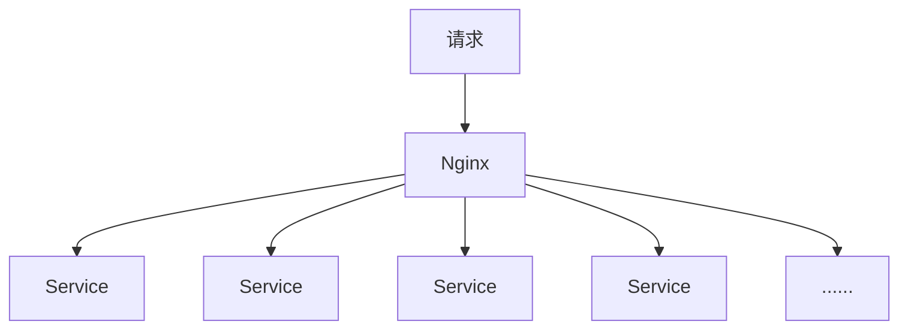

# 项目设计

## 微服务设计原则

设计架构/模式/拆分/隔离等的目标：**隔离系统的变化点**

### 具体原则

- 高内聚，低耦合：一个服务中只做一件事
- 高度自治：每个服务都可以独立的开发，测试，构建，部署，运行，发布。（无状态）
- 以业务为中心：每个服务有特定的业务逻辑
- 弹性设计：容错，隔离，降级等
- 自动化：持续集成，持续交付
- 粒度把控：微服务微到什么地步没有标准。遵循任何一个服务的开发和维护不能影响其他服务

### AKF 原则

**x 轴**：复制备份。集群，负载均衡。



**y 轴**：业务拆分。将一个业务中的某些步骤拆分出来，作为新服务。

**z 轴**：数据分区。例如按照地区存储数据

## 整体架构图


### 所用 SpringCloud 组件图


## 服务拆分

### 业务层

| 模块     | 项目名           | 描述     |
| -------- | ---------------- | -------- |
| 乘客端   | api-passenger    | 乘客端   |
| 司机端   | api-driver       | 司机端   |
| 司机听单 | api-listen-order | 司机听单 |

### 能力层

| 模块         | 项目名                    | 描述 |
| ------------ | ------------------------- | ---- |
| app 升级      | service-app-update        |      |
| 订单         | service-order             |      |
| 派单         | service-order-dispatch    |      |
| 乘客用户管理 | service-passenger-user    |      |
| 短信         | service-sms               |      |
| 计价         | service-valuation         |      |
| 验证码       | service-verification-code |      |
| 钱包         | service-wallet            |      |
| 支付         | service-payment           |      |

### Spring Cloud 基础服务层

| 模块     | 项目名                  | 描述 |
| -------- | ----------------------- | ---- |
| 注册中心 | cloud-eureka            |      |
| 配置中心 | cloud-config-server     |      |
| 网关     | cloud-zuul              |      |
| 熔断监控 | cloud-hystrix-dashboard |      |
| 健康检查 | cloud-admin             |      |
| 链路追踪 | cloud-zipkin-ui         |      |

### 基础 common

| 模块 | 项目名          | 描述                           |
| ---- | --------------- | ------------------------------ |
| 通用 | internal-common | 通用类，工具类，统一异常，校验 |

## 用到的技术

boot，cloud，maven，git，mysql，redis，active-mq

**第三方服务**

- 短信服务：腾讯，阿里云，华信
- 语音服务：隐私号（乘客和司机订单匹配后互相拨打的不是真实号码），录音。
- 文件服务：阿里 OSS
- 地图服务：高德
- 消息推送：极光。透传，通知。
- 支付：微信，支付宝
- 航路纵横：查航班
- 发票服务：百望云
- 前端：vue，android，ios

## 面试包装

商务都来公司，跟我们技术做个交流，我们也了解他们的技术情况等，和我们业务结合是否匹配，开发是否易用，稳定等

能力层：预估 1500 的并发量，压测 QPS：2000（4G 8core），有些服务 300

了解到 QPS（Query Per Second）如果还要增大，应该如何做。

QPS 和 TPS（Transaction Per Second）是通过压测测试出来的。

**关键词**

复盘，赋能，抓手，对标，沉淀，对齐，拉通，倒逼，课粒度，落地，中台，方法论，漏斗，组合全，闭环，生命周期，打法，履约，引爆点，串联，价值转化，纽带，矩阵，协同，反哺，点线面，认知，强化认知，强化心智，交互，兼容，包装，响应，刺激，规模，重组，量化，宽松，资源倾斜，完善逻辑，抽离透传，抽象，复用打法，发力，精细化，布局，商业模式，联动，场景，聚焦，快速响应，影响力，价值，细分，垂直领域，维度，定性定量，去中心化，关键路径，接地气，梳理，输出，格局，生态，结果导向，话术，体系，认知，分享，流程，感知度，加速，用户画像，摸索，提炼，玩法，共建，分发，支撑，抓手，体感，感知，融合，调性，心智，解耦，拆解，集成，对焦，拉通，打透，吃透，课粒度，迁移，分层，漏斗，战役，组合拳，合力，体系，心力，赛道。

## 接口设计

接口定义了之后，app，后端同时开发。

后端定接口。

### RESTful 风格

Representational State Transfer，表述性状态转移)，基于 http。**重在资源**

### 考虑的点

1. 协议：http/https。IOS 只能用 https（否则应用商店审核不过）

2. 域名：api.domain.com

3. 版本：v1

4. 路径：/xxoo/ooxx?param1=xx&param2=xx，URL 路径中只能是名词

5. 动作：

   post：新建

   put：修改（修改后的全量数据）

   patch：修改（修改哪个传哪个）

   delete：删除

   get：查询

## 接口安全

等保三级

1. CIA：保密性，完整性，可用性。

   保密性：数据传输和存储需要加密（手机号，身份证号，脱敏）

   完整性：数据不丢失。

   可用性：防止服务被恶意占用

2. 数据层面：SQL 注入。可通过 jsoup 框架对接口的输入参数进行过滤，jsoup 里的 xss whitelist（白名单）有 6 中方法，一个构造方法和 5 种静态方法。

3. XSS：跨站脚本攻击。黑客通过将一段脚本上传到服务器，使得其他用户在访问包含该脚本页面时，自动执行了脚本中包含的恶意代码。可使用 spring-htmlUtils 进行转义。也可使用 OWASP HTML Sanitizer，参考：[Java 对 html 标签的过滤和清洗](https://www.cnblogs.com/qizhelongdeyang/p/9884716.html)

4. CSRF：跨站请求伪造。可通过人机交互； token 解决

5. Referer：HTTP 请求头中的信息。跨站请求访问

6. 数据权限控制：用户对其没有权限的数据进行了操作。例如：A 用户请求，删除 order/a1；B 用户请求，删除 order/a1

**面试题**

1. XSS 和 CSRF 的区别?

    - XSS 是由于**没有对用户数据没有过滤，转义**，在正常用户请求中执行了黑客提供的恶意代码。

    - CSRF 是冒充别人的登录信息，**没有防范不信任的调用**。

## 微服务项目结构


项目在独立仓库中。

整体

```shell
| -- online-taxi-three
	| -- 项目 A
	| -- 项目 B
```

单独项目

```shell
| -- pom
	| -- src
        | -- controller
        | -- service
            | -- impl
        | -- dao
            | -- entity
            | -- mapper
        | -- manager
        | -- constant
        | -- request
        | -- response
	| -- resource
		| -- mapper
			| -- xxxMapper.xml
		| -- yml
```

### 异常的处理

DAO 层的异常：catch 到，然后抛出，不用打日志

Service 层的异常：打日志，详细信息，时间，参数等。

Controller 层的异常：捕获所有的异常，把异常包装成状态码
