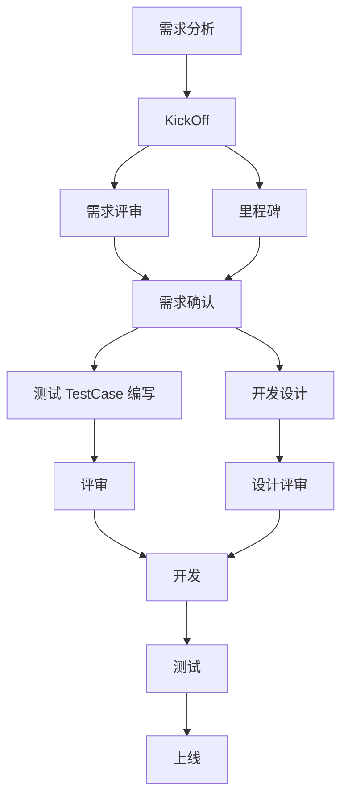

# 项目介绍

## 项目过程

### 第一阶段：启动阶段

可行性分析，立项。

**面试问题**

1. 为什么做这个项目？

2. 从技术人员角度考虑，该项目有什么长远的好处。

   残障人士（后备箱有轮椅），孕妇（开车比较稳的司机），小孩（儿童座椅）

### 第二阶段：计划阶段

进度安排，资源计划，成本估计，质量保证计划，风险，实施。

**面试问题**

1. 如果项目做不完了怎么办？

    1) 加班；2) 加人；3)功能排优先级，重要的先做保证能用，后面再迭代

### 第三阶段：实施控制阶段

开发，测试，部署，运维

### 第四阶段：收尾阶段

验收。产品验收。

## 项目和产品

**项目管理方式**：矩阵式，开发组分为 1 组，2 组；项目经理组也分 1 组，2 组，有项目需要做的时候，从开发组和产品组各选出几人组合成一组进行开发。

**项目开发流程**：

**面试题**

1. 项目开发过程中是严格按照上面的开发流程进行的吗？

   不是

2. 如果和同事之间发生矛盾，怎么处理

## 人员安排

项目管理：3 人（1 个高级项目经理，2 个助理）

技术总监：1 人

运维：2 人（1 个普通，1 个做容器化）

能力层：10 人

业务层：12 人

产品：10 人（乘客，司机，BOSS，h5）

安卓：4 人

ios：4 人

h5：4 人

测试：20 人（功能测试，自动化测试，接口测试，安全测试）

运营，市场，大客户关系：未知

**面试题**

1. 你在项目中的职责

   组长：接口定义，工程结构设计，代码 review，各方沟通（产品，测试），核心功能开发。

   组员：具体开发实现。核心功能开发。

Kick Off：各方（项目经理，产品，开发，测试，运营等），动员大会。14:00-22:00

## 实现需求

### 乘客端

1. 发送验证码
    - 三档验证。技术人员从技术上防止恶意发短信。
2. 登录/注册
3. 查看开通区域
    - 高德围栏
4. 预估价格。
5. 下单（呼叫司机）
6. （司机流程）
7. 支付（分布式事务：订单，支付，积分）
8. 评价

### 司机端

1. 发送验证码
2. 登录/注册
3. 查看/改变司机状态
4. 抢单（分布式锁）
5. 订单状态变更
6. 发起收款

### BOSS 端

运营端
